<!--
  README de perfil · conceito "sessão de terminal".
  assets/terminal.svg e assets/contrib.svg são animações autocontidas geradas por
  scripts/main.py (textos em scripts/config.py) e atualizadas diariamente pelo workflow
  .github/workflows/terminal.yml com dados reais (API do GitHub + página pública de contribuições).
-->

<picture>
  <source media="(max-width: 600px)" srcset="https://raw.githubusercontent.com/Luis-lhgdf/luis-lhgdf/main/assets/terminal-mobile.svg">
  
</picture>

  

&nbsp;&nbsp;

## <samp>$ cat stack.txt</samp>

<samp>backend&nbsp;&nbsp;&nbsp;&nbsp;&nbsp;&nbsp;&nbsp;&nbsp;&nbsp;</samp>     
<samp>infra&nbsp;&nbsp;&nbsp;&nbsp;&nbsp;&nbsp;&nbsp;&nbsp;&nbsp;&nbsp;&nbsp;</samp>       
<samp>dados&nbsp;&nbsp;&nbsp;&nbsp;&nbsp;&nbsp;&nbsp;&nbsp;&nbsp;&nbsp;&nbsp;</samp>     
<samp>automação &amp; ia&nbsp;&nbsp;</samp>    

## <samp>$ cat projetos.txt</samp>

| repositório | stack | o que faz |
|:--|:--|:--|
| [`python-world`](https://github.com/Luis-lhgdf/python-world) | Python · customtkinter · OpenAI API | exercícios de Python 3 com correção automática via API da OpenAI |
| [`sys-comercial`](https://github.com/Luis-lhgdf/sys-comercial) | Python · SQL | da planilha ao sistema: gestão comercial para pequenas empresas |
| [`claudecode-usage-widget`](https://github.com/Luis-lhgdf/claudecode-usage-widget) | Python · PowerShell · Windows | widget desktop com os limites de uso do Claude Code, sem dependências |

<samp>$ ls -a ~/projetos</samp> &nbsp;mais projetos

 

| repositório | stack | o que faz |
|:--|:--|:--|
| [`bot-excel`](https://github.com/Luis-lhgdf/bot-excel) | Python · customtkinter · pandas | automação de planilhas .xlsx com interface gráfica simples |
| [`ztype-botgame`](https://github.com/Luis-lhgdf/ztype-botgame) | Python · OCR · visão computacional | bot com reconhecimento de imagem e texto para o jogo ZType |
| [`portfolio`](https://github.com/Luis-lhgdf/portfolio) | HTML · SCSS · JavaScript | código do portfólio publicado no GitHub Pages |

## <samp>$ git log --graph</samp>

<picture>
  <source media="(max-width: 600px)" srcset="https://raw.githubusercontent.com/Luis-lhgdf/luis-lhgdf/main/assets/contrib-mobile.svg">
  
</picture>

## <samp>$ cat contato.txt</samp>

<samp>linkedin&nbsp;&nbsp;&nbsp;</samp> [linkedin.com/in/luis-henrique-281b97186](https://www.linkedin.com/in/luis-henrique-281b97186/) 
<samp>portfólio&nbsp;&nbsp;</samp> [luis-lhgdf.github.io/portfolio](https://luis-lhgdf.github.io/portfolio/) 
<samp>e-mail&nbsp;&nbsp;&nbsp;&nbsp;&nbsp;</samp> [luis.dev_@outlook.com](mailto:luis.dev_@outlook.com)

 

<samp>luis@backend:~$ echo "Talk is cheap. Show me the code."</samp>

